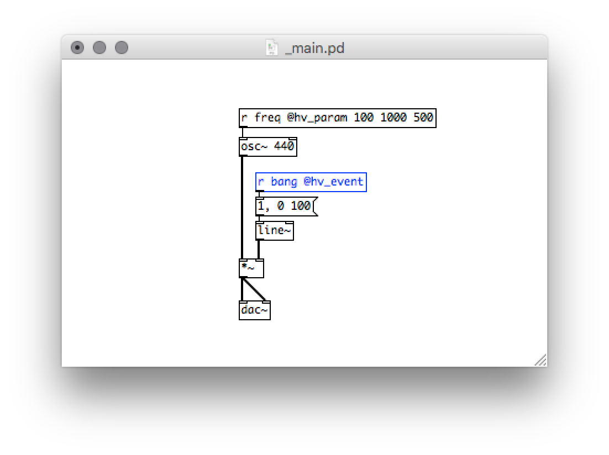
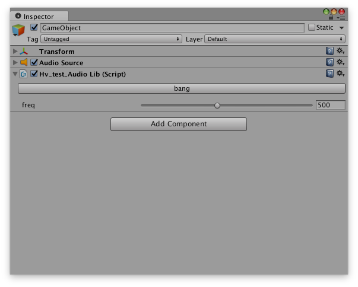
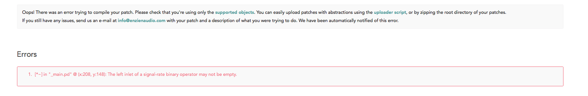
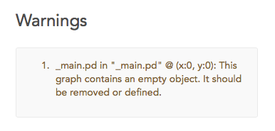

# Getting Started

## Audio Input/Output
To receive audio input into your patch add an `[adc~]` object.

To send audio output add a `[dac~]` The number of channels can be configured by providing arguments to object. For example `[dac~ 1 2 3]` will generate three output channels. `[adc~ 1]` will make a single channel of audio input.

Note that top-level graphs (e.g. `_main.pd`) should not have any `[inlet~]` or `[outlet~]` objects. These are reserved only for abstractions.

## Exposing Parameters

### Input Parameters

All (control) `[receive]` and `[r]` objects annotated with `@hv_param` will be exposed as **input** parameters in each framework. The name provided will propagate through to the plugin interface.

For example, `[r gain @hv_param 0 1 0.5]` will show up as "gain", with a minimum value of 0, a maximum value of 1, and a default value of 0.5. If a patch has multiple exposed receivers with the same name, they must all have the same minimum, maximum, and default values as well.

Receivers not annotated with `@hv_param` are still completely functional, they simply will not be exported to the framework interface.

### Output Parameters

In the same manner as above, all (control) `[send]` and `[s]` objects annotated with `@hv_param` will be exposed as **output** parameters.

For example, `[s envelope @hv_param]`.

Messages passed to these send objects can be forwarded on to other parts of the application. This is useful for creating audio-driven behaviours or extracting analysis information.

See the specific framework details for more information on output parameter support and integration details.

## Exposing Events
All (control) `[receive]` and `[r]` objects annotated with `@hv_event` will be exposed as events in the Unity target only.

For example, `[r bang @hv_event]` will show up as a button called "bang" in the Unity Editor interface.

See the [Unity docs](#05.unity#exposing-and-sending-events) for more information on exposing events and controlling them.

## Errors
If there's an incompatibility within the patch, Heavy will generate an error message.

## Warnings
Heavy will also perform patch analysis to look for common mistakes and inconsitencies between Pd and heavy behaviour. The targets will still be generated correctly but it might be useful information for example when cleaning up the patch.

## Reporting Issues

If you experience any problems or have some thoughts on how to improve heavy make sure to browse and contribute to our [public issue tracker](https://github.com/enzienaudio/heavy/issues).
