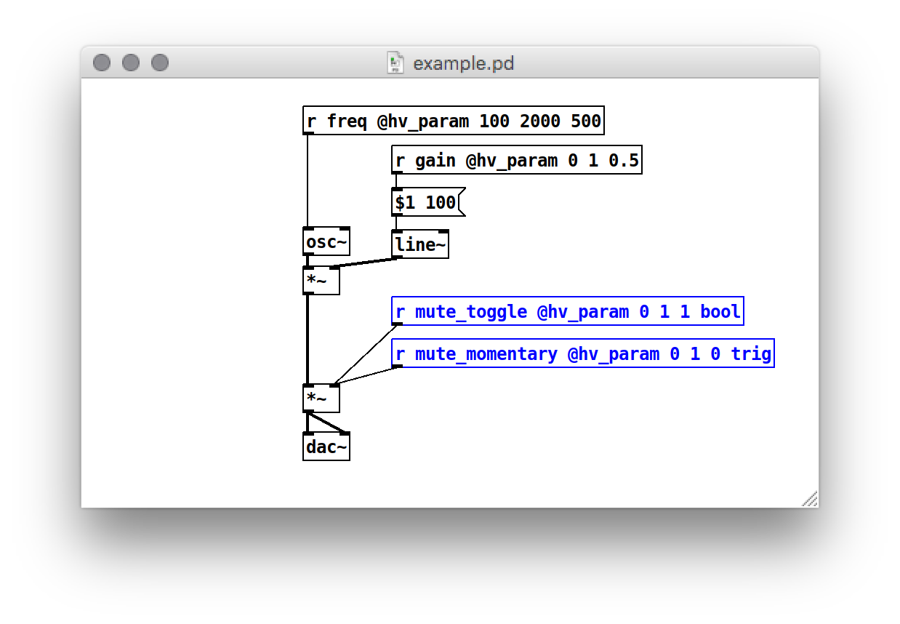

# DPF

Heavy can generate LV2, VST2, VST3, and CLAP plugins from your patch using the [Distrho Plugin Framework](https://github.com/DISTRHO/DPF). It can be either a synth (output-only) or an effect (input and output), supports an arbitrary number of parameters, and can process midi events.

Some [examples](https://github.com/Wasted-Audio/hvcc-examples-dpf) are built for the major operating systems (Linux/Windows/MacOS) in various formats (LV2/VST2/VST3/CLAP).

## Defining Parameters
Each [exposed parameter](02.getting_started.md#exposing-parameters) will automatically generate a slider in the plugin interface.

## MIDI Control
In order to receive MIDI note on and off events, as well as control change messages, the `[notein]` and `[ctlin]` objects should be used, respectively.

DPF supports all note/ctl/pgm/touch/bend I/O events. The implementation is further discussed in the [midi docs](04.midi.md)


## Parameter Types
In DPF a parameter can get an optional type configured. The default type is `float`. Other assignable types are `bool` - for toggling a value - and `trig` - for momentary signals.



Using jinja the `v.attributes.type` can be evaluated for a specific string and different templating applied to the parameter. In DPF the extra types `bool` and `trig` result in the following plugin code:

```c++
        parameter.hints = kParameterIsAutomable | kParameterIsBoolean;
// or
        parameter.hints = kParameterIsAutomable | kParameterIsTrigger;
```

## Metadata

An accomponying metadata.json file can be included to set additional plugin settings.

The `project` flag creates a `README.md` and `Makefile` in the root of the project output, but may conflict with other generators.

Each of these are optional and have either a default value or are entirely optional (description and homepage). Midi i/o ports are on by default, but can be set to `0` and they will be disabled - currently `midi_input` always has to be on!.


```json
{
    "dpf": {
        "project": true,
        "description": "super simple test patch",
        "maker": "nobody",
        "homepage": "https://wasted.audio/plugin/dpf_example",
        "plugin_uri": "lv2://wasted.audio/lv2/dpf_example",
        "version": "6, 6, 6",
        "license": "WTFPL",
        "midi_input": 1,
        "midi_output": 0,
        "plugin_formats": [
            "lv2_dsp",
            "vst2",
            "vst3",
            "clap",
            "jack"
        ]
    }
}
```

## Notes
* The `[notein]` object is the only supported means of receiving MIDI note events (i.e. Note On and Note Off). Arguments to the object (e.g. to specify the channel number) will be ignored. Velocity of `0` will be assumed to mean Note Off
* The `[ctlin]` object is the only supported means of receiving MIDI control change events. Arguments to the object (e.g. to filter which CC event is delivered) will be ignored.
* If you are compiling from source, make sure to read the included `README.md` file in the root directory.
