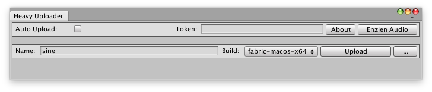
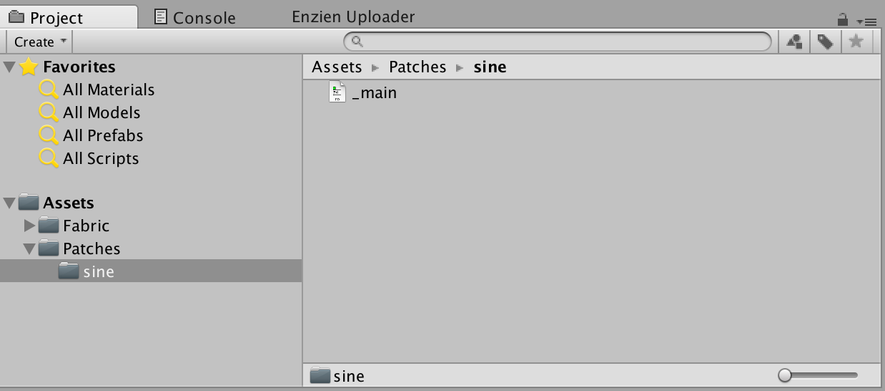
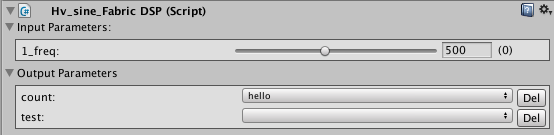
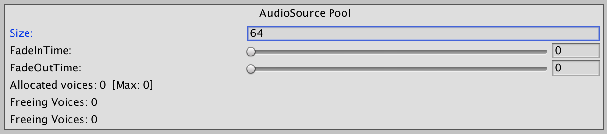
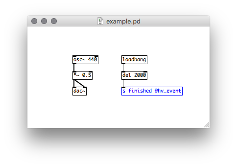

# Fabric

[Fabric](http://www.tazman-audio.co.uk) is a powerful Unity-based audio middleware solution extending the features available and providing custom user interfaces.

Heavy can generate Fabric specific DSP plugins for a variety of use cases, including sound generators, effects units and continuous or one-shot style sounds.

## Getting Started

* Create a new Unity project, or start with an existing one.

* [Download Fabric (>= v2.2.8.p3)](http://www.tazman-audio.co.uk/downloads)

* Install Fabric either by dragging the package into the project. Or through the Unity menu:

    `Assets > Import Package > Custom Package > select Fabric .unitypackage`

* [Download the Fabric Heavy Uploader Plugin](http://www.tazman-audio.co.uk/fabric-integrations)

* Again install this package into the Unity project.

## Fabric Heavy Uploader

Don't want to manually organise patches and plugin scripts and binaries in your projects? The `Fabric Heavy Uploader` is made for you!

Once installed the uploader window can be accessed through the menu:
    `Window > Fabric > Integrations > Heavy Uploader`



If the Menu item is greyed out then make sure to select the Fabric Manager object in your scene heirarchy first.

Interface Features:
* `Auto Upload`: when enabled the uploader watches for changes in the patch and automatically sends then to the **heavy** server.
* `Token`: allows the uploader to correctly authenticate with your account.
* `About`: shows the Fabric Heavy Uploader version.
* `Enzien Audio`: a link to the **heavy** site.
* `Build`: choose which platform plugin to download
* `Upload`: Uploads the current patch and downloads the selected 'Build' option.
* `...`: Context menu showing two options:
    - `Clean Patch`: removes all downloaded plugin binaries for the selected patch.
    - `Delete Patch`: removes all assets related to the patch including the patch file itself.

## Tokens

In order to authenticate with **heavy** a user token will need to be generated and stored in the Fabric Heavy Uploader.

See the [Token documentation](#02.getting_started#tokens) for information on managing your tokens.

Copy your generated user token to the `Token` field of the Fabric Heavy Uploader interface.

## Creating a new patch

* Note: Currently it is neccessary to first create a new patch on the **heavy** site.

Then in your Assets folder create a directory that contains the new patch. The name of the folder will be the name that the Fabric Heavy Uploader will reference when uploading to the **heavy** server. Make sure it is the same as the one pre-created on the site.

The minimum requirement is to have a patch named `_main.pd`, this will be used as the top-level reference. Other patch abstractions and files can also be included in this directory.

See the image below as an example:



## Generating a DSP plugin

After following the previous steps, in the Fabric Heavy Uploader window select the appropriate `Build` option to generate and click `Upload`.

The plugin assets will be automatically managed.

## Using a DSP plugin

### Basic Fabric Initialisation

For a quick Fabric setup follow these instructions:

* Create and a new Fabric Manager (`Menu > Fabric > FabricManager`)
    * Select the Manager in the object heirarchy.
    * Add an Event to the Fabric Manager's Event Manager, for example 'Test'.
    * Add a DSP plugin `(Menu > Fabric > Components > Heavy > {patch})`
* Select the newly added DSP plugin object.
    * Add a Listener (`Add Component > Fabric > Events > Listener`).
    * Set the Listener's Event Name to 'Test'.
* Create a separate empty gameobject in the top-level scene hierarchy.
    * Select the new gameobject.
    * Add a Trigger (`Add Component > Fabric > Events > Trigger`).
    * Set the Trigger's Event Name to 'Test'.
* Press play in Unity.

## Plugin Types

The type of plugin that **heavy** generates is dynamically determined depending on the [I/O channel configuration](#02.getting_started#audio-input-output).

### Generator

A patch that __doesn't__ contain an `[adc~]` will result in a `Generator` unit being created (i.e. a simple sinewave or synth). This only outputs audio an audio signal.

### Effect

If an `[adc~]` object exists in the patch the generated plugin with be an `Effect` unit, for processing input audio sources (i.e. a filter, compressor, distortion fx).

* Note: make sure that the corresponding AudioSource component's AudioClip property is set to Null.

## Parameters

The Fabric target supports both [input and output parameters](#02.getting_started#exposing-parameters) which can be used to either control the patch from Fabric, or to control Fabric from the patch.

### Input Parameters

Input parameters will display a slider control and can also be automated or script within Fabric.

### Output Parameters

Output parameters will display a popup menu next their respective name that enables bindings to existing Global Parameters defined in Fabric. Use these to create an audio-driven system.



## Playback Types

Typically in sample-based approaches, sounds can be categorised roughly as either being a one-shot or a continuous loop. This playback behaviour can be similarly recreated with **heavy**.

### Continuous

By default, once a plugin is triggered to start via a Fabric Event it will continue with an infinite duration until given a Stop command.

### One-shots

However, the patch itself can instruct Fabric to stop itself from playing and remove it from the playback pool.

First make sure that within the Fabric Manager object, the AudioSource Pool's `Size` property is set to a non-zero number.



Then at any point you can send a `bang` message to a `[send finished @hv_event]` object in the patch, which will then instruct Fabric to stop playback.

The example patch below will play a sinewave sound for 2 seconds before ending:



## Compiling the Plugin
Each platform has its own way of compiling the plugins.

### MacOS
An Xcode project exists in the `unity/xcode` directory and the plugin may be built manually. It can also be compiled directly from the commandline.
```bash
$ cd unity/xcode
$ xcodebuild -project Hv_heavy_Fabric.xcodeproj -arch x86_64 -alltargets
```
The results are placed in `unity/build/macos/x86_64/Release`.

### Linux
```bash
$ cd unity/linux
$ make -j
```
The results are placed in `unity/build/linux/x86_64/release`.

### Windows
A Visual Studio 2015 project exists in the `unity/vs2015` directory and the plugin may be built manually. It can also be compiled directly from the commandline.
```bash
$ cd unity/vs2015
$ "C:/Program Files (x86)/MSBuild/14.0/Bin/MSBuild.exe" /property:Configuration=Release /property:Platform=x64 /t:Rebuild Hv_heavy_Fabric.sln /m
```
The results are placed in `unity/build/win/x64/Release`.

Plugins for x86 may also be built by specifying `/property:Platform=x86`.

### Android
```bash
$ cd unity/android
$ ndk-build APP_ABI=armeabi-v7a -j
```
The results are placed in `unity/build/android/libs/armeabi-v7a`.
