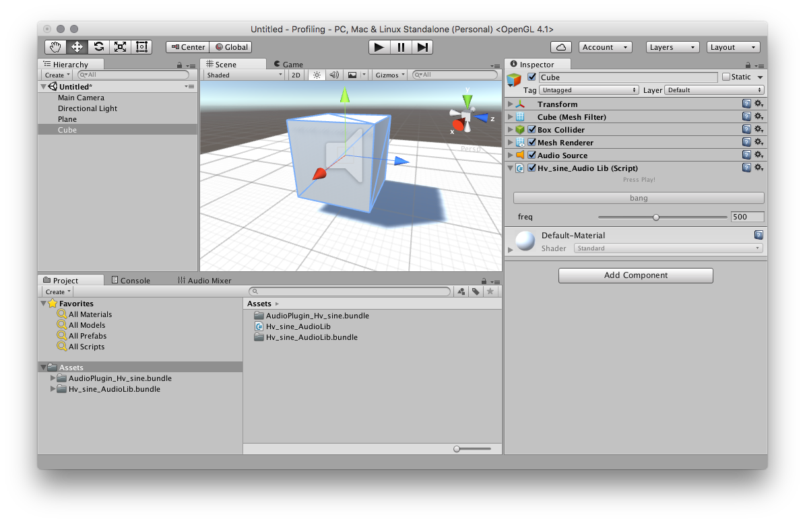
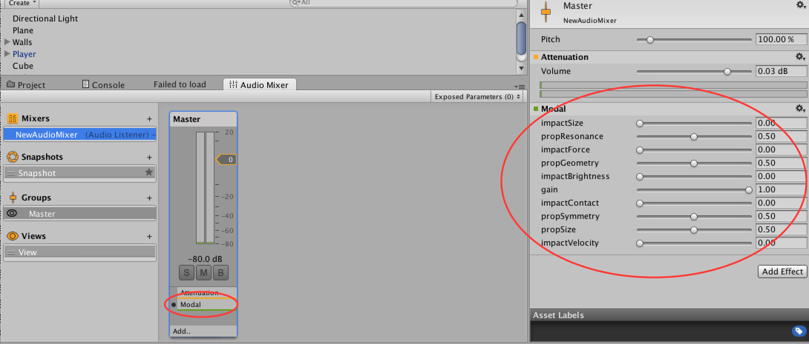
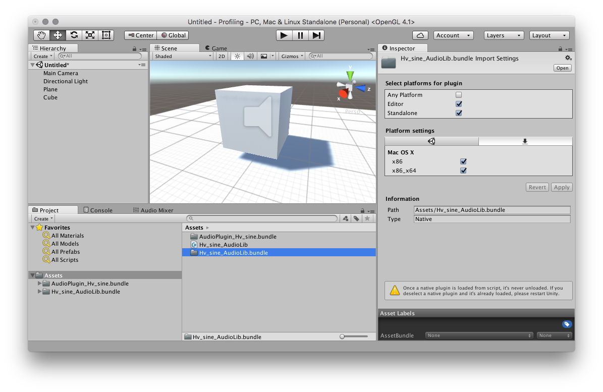
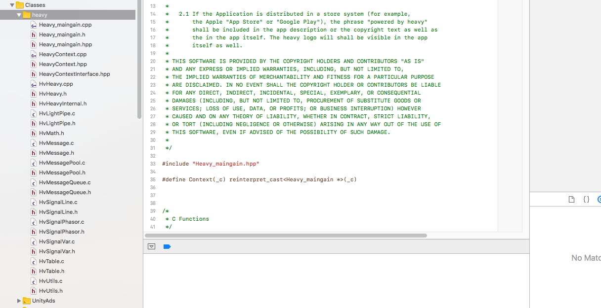

# Unity

## Getting Started
Heavy can generate both Native Unity Audio Libraries with a C# scripting interface and Unity 5 Audio Mixer Plugins. Both have the same sound output but slightly different use cases within Unity.

There are four main output targets for the Unity platform. Heavy can generate 64-bit OSX bundles, 32-bit and 64-bit Windows libraries, and of course the source code to inspect, extend, and generate your own plugins.

Windows binaries only work on Windows 8 and Windows 10. They do not work on Windows 7 but you can still build your own Windows 7 binaries from the provided source.

## Audio Libs
Audio Libs are platform-specific native libraries. The C code generated by the patch is compiled into a binary and a C# interface is provided for access. You can attach this C# script to GameObjects within your scene in order for the sound to be spatially processed within the game world. These plugins can also act as a filter for AudioSource components when stacked together on a particular GameObject.

The below image shows an example of a Heavy generated plugin `Hv_sine_AudioLib` attached to a cube object.



## Audio Plugins
The Audio Mixer in Unity allows you to bus audio sources for mixing, effects processing and mastering. Plugins for the Audio Mixer have the filename prefix AudioPlugin. Any that exist within the Assets folder and its subdirectories will be found by Unity. They are available to add to the mixer group, taking the patch name that is passed when generated.

In the image below the `AudioPlugin_Hv_Modal` has been added and the parameters are shown on the right hand side.



For more information on exposing parameters to audio mixer plugins and accessing them in scripts check out [this Unity tutorial](https://www.youtube.com/watch?v=9tqi1aXlcpE).

## Installing a plugin
When it comes to adding plugins to your project the best practice is to create a folder within the Assets directory called Plugins. For cross-platform games it might also be useful to create platform specific subdirectories to organise each binary, for example: `Assets/Plugins/x86`, `Assets/Plugins/x64`, `Assets/Plugins/WSA/x86`, etc...

Each compiled target will contain the following files (OSX plugins have the `.bundle` extension, on Windows the extension is `.dll`):
* `Hv_{PATCH_NAME}_AudioLib.cs` - Native Plugin C# interface
* `Hv_{PATCH_NAME}_AudioLib` - Native Plugin dll / bundle
* `AudioPlugin_Hv_{PATCH_NAME}` - Audio Mixer Plugin dll / bundle



Ensure that the platform settings have been applied to each plugin binary you wish to use and that paths are correct. `x86` corresponds to 32-bit platforms and `x86_x64` is for 64-bit platforms.

When building for mobile devices it's generally best to download the plugin target for your development platform (windows/macos) _and_ the device platform (ios/android). The development platform plugins will allow testing in the Unity editor and standalone builds. See the Android/iOS specific instructions below for more information.

Note: Unity has to be restarted each time the plugin file changes on the local hard disk.

## Exposing and Setting Parameters

Each [exposed parameter](#02.getting_started#exposing-parameters) will automatically generate a parameter in the Unity Editor interface. These parameters can be scripted easily from elsewhere in your project.

```
public class MyAudioLibController : MonoBehaviour {
    void Start () {
        Hv_example_AudioLib script = GetComponent<Hv_example_AudioLib>();
        // Get and set a parameter
        float freq = script.GetFloatParameter(Hv_example_AudioLib.Parameter.Freq);
        script.SetFloatParameter(Hv_example_AudioLib.Parameter.Freq, freq + 0.1f);
    }
}
```

## Exposing and Sending Events

[Exposed events](#02.getting_started#exposing-events) are a way to generate triggers or 'bangs' into your patch. Adding one will automatically generate a button in the Unity Editor interface. These events can be scripted easily from elsewhere in your project.

The event receiver in the patch will generate a 'bang' message each time it is fired. These can be useful for example, triggering synth notes from a Unity based sequencer or aligning a procedural gunshot sound to point at when it is fired.

```
public class MyAudioLibController : MonoBehaviour {
    void Start () {
        Hv_example_AudioLib script = GetComponent<Hv_example_AudioLib>();
        script.SendEvent(Hv_example_AudioLib.Event.Bang);
    }
}
```

## Sending messages back to Unity
Any output parameter in the patch can be routed back into Unity.

A C# delegate can be attached to the native plugin wrapper script that listens for callbacks when these messages are triggered.

The `FloatMessage` object contains a property `receiverName` to determine the origin and the `value` property contains the actual float value contained in the message.

For example, if `0.5` is sent to `[s #toUnity @hv_param]`, then `message.receiverName` will contain `#toUnity` and `message.value` will contain `0.5`.

Example:

```
public class MyMessageDelegate : MonoBehaviour {

    void Start () {
        Hv_sine_AudioLib script = GetComponent<Hv_sine_AudioLib>();
        script.RegisterSendHook();
        script.FloatReceivedCallback += OnFloatMessage;
    }

    void OnFloatMessage(Hv_sine_AudioLib.FloatMessage message) {
        Debug.Log(message.receiverName + ": " + message.value);
    }
}
```


## Accessing Audio Tables

For Native Plugins, audio tables can be accessed externally from scripts in the Unity engine to set sample buffers within the patch.

There are two methods in the C# interface to facilitate this:

### From an [AudioClip](http://docs.unity3d.com/ScriptReference/AudioClip.html)
```
/**
 * Fill a table with sample data contained in the left (or mono) channel of a
 * Unity AudioClip object.
 *
 * This function is NOT thread-safe. It is assumed that only the audio thread will
 * execute this function.
 */
void FillTableWithMonoAudioClip(string tableName, AudioClip clip)
```

Example:

```
public class MySampleLoader : MonoBehaviour {

	public AudioClip _clip; // attach a sample in the editor
	private Hv_sine_AudioLib _audio;

	void Start() {
		_audio = GetComponent<Hv_sine_AudioLib>();
		// ensure that there is a table in the patch called 'sample-1'
		_audio.FillTableWithMonoAudioClip("sample-1", _clip);
	}
}
```

### From a float buffer
```
/**
 * Fill a table with sample data contained in a float array.
 *
 * This function is NOT thread-safe. It is assumed that only the audio thread will
 * execute this function.
 */
void FillTableWithFloatBuffer(string tableName, float[] buffer)
```

## Compiling the Plugin
Each platform has its own way of compiling the plugins.

### MacOS
An Xcode project exists in the `unity/xcode` directory and the plugin may be built manually. It can also be compiled directly from the commandline.
```bash
$ cd unity/xcode
$ xcodebuild -project Hv_heavy_Unity.xcodeproj -arch x86_64 -alltargets
```
The results are placed in `unity/build/macos/x86_64/Release`.

### Linux
```bash
$ cd unity/linux
$ make -j
```
The results are placed in `unity/build/linux/x86_64/release`.

### Windows
A Visual Studio 2015 project exists in the `unity/vs2015` directory and the plugin may be built manually. It can also be compiled directly from the commandline.
```bash
$ cd unity/vs2015
$ "C:/Program Files (x86)/MSBuild/14.0/Bin/MSBuild.exe" /property:Configuration=Release /property:Platform=x64 /t:Rebuild Hv_heavy_Unity.sln /m
```
The results are placed in `unity/build/win/x64/Release`.

Plugins for x86 may also be built by specifying `/property:Platform=x86`.

### Android
```bash
$ cd unity/android
$ ndk-build APP_ABI=armeabi-v7a -j
```
The results are placed in `unity/build/android/libs/armeabi-v7a`.

Android builds are specifically made for the `armeabi-v7a` architecture but will function with Unity's `ARMv7` CPU setting.

The easiest method for installing Android plugins is to place them in this specific folder `/Assets/Plugins/Android/`. Doing this will ensure Unity copies over the plugin into the APK correctly

See the Unity documentation for more information: https://docs.unity3d.com/Manual/PluginInspector.html

### Building for iOS

iOS builds are unique in that the source code is needed when compiling the Unity game for the device.

Once the game is working as expected in the Unity editor (the macos plugins are required for that) and the heavy C# scripts are correctly attached to the gameobjects, go to `File` > `Build Settings` in the Unity menu. Then generate the Xcode project by selecting iOS platform, adding the required scenes and clicking `Build`.

Open the Xcode project from the directory previously selected in Unity's build menu.

Create a new group in the left-hand side Project explorer section, the group name is not important but in this case we'll called it `heavy`.

Download the [Unity source target](#02.getting_started#using-the-generated-targets) from the patch compile page and copy the contents of the `source/heavy/` folder into the `heavy` Xcode group that was created previously. Make sure to copy every file.



That's all that is needed when using [Audio Libs](#06.unity#audio-libs).

For [Audio Plugins](#06.unity#audio-plugins) the additional files from `/source/unity/` will also need to be copied into the Xcode project, though ignore the C# (.cs) file.
