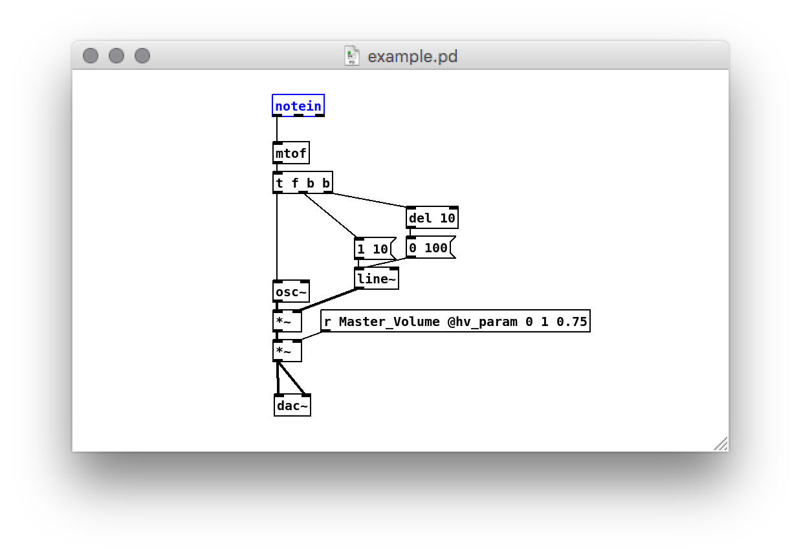

# VST

Heavy can generate a VST 2.4 plugin from your patch. It can be either a synth (output-only) or an effect (input and output), supports an arbitrary number of parameters, and can process midi events. In addition to source code, Heavy will also build a universal 32/64-bit OSX VST, a 64-bit Windows VST DLL, or 64-bit Linux VST shared object, for you.

## Defining Parameters
Each [exposed parameter](#02.getting_started#exposing-parameters) will automatically generate a slider in the VST interface.

## MIDI Control
In order to receive MIDI note on and off events, as well as control change messages, the `[notein]` and `[ctlin]` objects should be used, respectively.




## Notes
* The `[notein]` object is the only supported means of receiving MIDI note events (i.e. Note On and Note Off). Arguments to the object (e.g. to specify the channel number) will be ignored.
* The `[ctlin]` object is the only supported means of receiving MIDI control change events. Arguments to the object (e.g. to filter which CC event is delivered) will be ignored.
* If you are compiling from source, make sure to read the included `README.md` file in the root directory.

## Compiling the Plugin
Each platform has its own way of compiling the plugins.

### VST SDK
Unfortunately due to legal restrictions, Enzien is unable to distribute the VST2 header files by Steinberg. In order to compile the VST on your own, download the latest VST3 Audio Plug-Ins SDK from the [Steinberg Developer site](http://www.steinberg.net/en/company/developers.html).
* Make a local directory in `source` called `vst2`.
* Copy all of the files in the VST SDK `public.sdk/source/vst2.x` directory, *except* for `vstplugmain.cpp`, into the local `source/vst2` directory.
* Copy the VST SDK `pluginterfaces/vst2.x` directory to the `source/vst2` directory.

The resulting directory structure should look like this:
* `/YOUR_HEAVY_VST_DIRECTORY`
  * `README.md`
  * `/xcode`
    * `Xcode project`
    * `Info.plist`
  * `/vs2015`
    * `Visual Studio solution`
    * `Visual Studio project`
  * `/source`
    * Heavy source files (`*.h`, `*.c`)
    * `HeavyVst2_PATCHNAME.h`
    * `HeavyVst2_PATCHNAME.cpp`
    * `/vst2`
      * `aeffeditor.h`
      * `audioeffect.cpp`
      * `audioeffect.h`
      * `audioeffectx.cpp`
      * `audioeffectx.h`
      * `/pluginterfaces`
        * `/vst2.x`
          * `aeffect.h`
          * `aeffectx.h`
          * `vstfxstore.h`

### MacOS
An Xcode project exists in the `unity/xcode` directory and the plugin may be built manually. It can also be compiled directly from the commandline.
```bash
$ cd unity/xcode
$ xcodebuild -project heavy.xcodeproj -arch x86_64 -alltargets
```
The results are placed in `unity/build/macos/x86_64/Release`.

### Linux
```bash
$ cd unity/linux
$ make -j
```
The results are placed in `unity/build/linux/x86_64/release`.

### Windows
A Visual Studio 2015 project exists in the `unity/vs2015` directory and the plugin may be built manually. It can also be compiled directly from the commandline.
```bash
$ cd unity/vs2015
$ "C:/Program Files (x86)/MSBuild/14.0/Bin/MSBuild.exe" /property:Configuration=Release /property:Platform=x64 /t:Rebuild heavy.sln /m
```
The results are placed in `unity/build/win/x64/Release`.

Plugins for x86 may also be built by specifying `/property:Platform=x86`.
