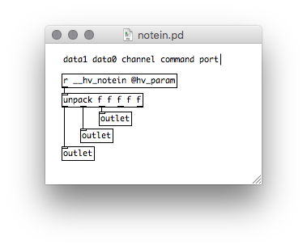

# MIDI I/O

In PureData there are objects to handle interfacing with a machines MIDI device.

**heavy** doesn't provide cross-platform implementation for MIDI I/O as the requirements tend to change depending on the platform or framework being used. 

Instead, it provides wrappers around these objects that route the data to specific hard-coded receivers/parameters in the patch context. For example a `[notein]` object will be replaced by a `[r __hv_notein]` receiver with input data split into its constituent parts and routed to the appropriate outlet.

`[notein]` wrapper implementation:




## Inputs

The following Pd objects are mapped to their corresponding heavy parameter.

| Pd object | heavy param    |
| --------- | -------------- |
| [notein]  | __hv_notein    |
| [ctlin]   | __hv_ctlin     |
| [pgmin]   | __hv_pgmin     |
| [bendin]  | __hv_bendin    |
| [touchin] | __hv_touchin   |


## Outputs

The same principle applies for sending MIDI data out of the heavy context. If you add a [noteout] object there'll be a corresponding sendhook callback with a message containing the MIDI data sent by the patch.

| Pd object  | heavy sendhook |
| ---------  | -------------- |
| [noteout]  | __hv_noteout   |
| [ctlout]   | __hv_ctlout    |
| [pgmout]   | __hv_pgmout    |
| [bendout]  | __hv_bendout   |
| [touchout] | __hv_touchout  |

## Note!

`It is generally the users responsibility to convert to and from the MIDI byte data to the float values used by heavy.`

Some framework targets like `vst2` already have implementations available. However, if you're integrating the C/C++ code on a custom platform then you'll need to provide your own conversion process.

Here's the `vst2` implementation as an example:

```
VstInt32 HeavyVst2_sine::processEvents(VstEvents* events) {
  for (int i = 0; i < events->numEvents; ++i) {
    VstEvent *vste = events->events[i];
    switch (vste->type) {
      case kVstMidiType: {
        VstMidiEvent *vstme = (VstMidiEvent *) vste;

        const unsigned char command = vstme->midiData[0] & 0xF0;
        const unsigned char channel = vstme->midiData[0] & 0x0F;
        const unsigned char data0   = vstme->midiData[1] & 0x7F;
        const unsigned char data1   = vstme->midiData[2] & 0x7F;

        hv_uint32_t receiverHash = 0;
        switch (command) {
          case 0x80:   // note off
          case 0x90: { // note on
            receiverHash = 0x67E37CA3; // __hv_notein
            break;
          }
          case 0xB0: { // control change
            receiverHash = 0x41BE0F9C; // __hv_ctlin
            break;
          }
          default: continue;
        }

        _context->sendMessageToReceiverV(receiverHash, 1000.0*vste->deltaFrames/sampleRate, "fffff",
            (float) data1,
            (float) data0,
            (float) channel,
            (float) command,
            0.0f // port
        );
        break;
      }
      case kVstSysExType: {
        // not handling this case at the moment, VstMidiSysexEvent *vstmse;
        break;
      }
      default: break;
    }
  }
  return 1;
}
```

