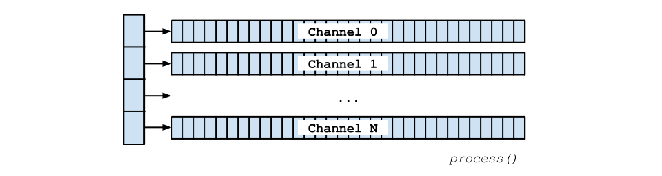

# C API

The Heavy C API is the lowest-level programming interface to a Heavy patch. It allows a high degree of control over all aspects of its function, and its performance and debugging can be greatly influenced by use of platform-specific compiler options. This is the place to be for the maximum amount of control over how the patch executes on a device.

The C API is functionally equivalent to the [C++ API](#13.cpp).

## Patch names

The API has a standard architecture of a `HeavyContextInterface` struct which contains all of the patch state, and a set of functions which operate on that state.

The struct is named after the patch project, and in this way can be distinguished from other patch structures. For example, given a patch name "example" the generated header file is called `Heavy_example.h` and patch-specific API methods begin with `hv_example`. All examples in this documentation will use this prefix.


## Getting Started
Initialising a Heavy context simply requires passing through the expected sampling rate (in Hertz) of the data to process. The sampling rate cannot be set at any time other than at initialisation; it cannot be changed. The basic constructor is `hv_example_new()`.

### Constructor Options
There is a more detailed constructor `hv_example_new_with_options()` which allows more control. The parameters include:
* `sample rate` (in Hertz): as above
* `message pool size` (in kilobytes): The message pool is an internal data structure which keeps track of all scheduled messages in the context. If the application requires many messages to be tracked simultaneously and runs out of space, try increasing the size of the pool. It has a default size of 10KB.
* `message queue size` (in kilobytes): All message scheduling functions are thread-safe and may be used while the context is being processed by another thread (generally the audio thread). The message queue is a lockless queue delivering messages between the sending thread and the processing thread. It holds messages scheduled between one invocation of the `process()` function to the next. The default size is 2KB, but may need to be larger if especially many or large messages are scheduled.

### Notes on Memory Usage
All memory allocation is performed at initialisation. New memory is not allocated on the heap after `_new()` is called. In general, a Heavy context allocates memory up front and uses a custom memory manager to keep track of state. The stack is used extensively to keep track of temporary information, especially in relation to message passing.

If it is necessary to manually monitor memory usage the `hv_malloc`, `hv_realloc`, and `hv_free` macros may be overridden in `HvUtils.h` ([see below](#08.c#hvutils-h)). Note that `hv_malloc` should *always* allocate aligned memory suitable for use by SIMD operations (typically 16- or 32-byte aligned for NEON and SSE, or AVX, respectively).

### Freeing the Context
When the context is no longer needed it must be freed with `hv_delete()`. This will release all memory and resources associated with the context.

```
#include "Heavy_example.h"

int main(int argc, const char *argv[]) {
  double sampleRate = 44100.0;

  Heavy_example *context = hv_example_new(sampleRate);

  // or alternatively you can use a pointer to the generic HeavyContextInterface type
  HeavyContextInterface *context = hv_example_new(sampleRate);

  // do something

  hv_delete(context);
  return 0;
}
```

## Processing Samples
The C API has functions to process sample buffers either as an array of arrays, or as inlined arrays, which may also be interleaved. Choose the correct method based on the format of your data.

The input and output buffers may refer to the same array, i.e. in-place processing is supported. It is possible to pass through a respective `NULL` value if there are no input or output channels.

The last parameter of any `process()` function is the frame size of the in/out sample data. The block size should be a multiple of 1, 4, 4, or 8 depending on what SIMD optimisation is being used, i.e. None, SSE, NEON, or AVX respectively.

### Block Sizes and SIMD
Use of hardware SIMD operations can dramatically speed up the processing of Heavy contexts by up to 8 times. For instance, if SSE optimisation is being used, then the internal block size of Heavy is 4 (because SSE processes vectors of 4 `float`s at a time). If a `process()` function is asked to process a number of samples that is *not* a multiple of 4, then the remaining samples (up to 3) *will remain unprocessed*. The `process()` function returns the number of samples that it did compute.

### hv_process()
Expected buffer format is as an array of float sample arrays:



```
#include "Heavy_example.h"

int main(int argc, const char *argv[]) {
  double sampleRate = 44100.0;

  Heavy_example *context = hv_example_new(sampleRate);

  int numIterations = 100;
  int numOutputChannels = hv_getNumOutputChannels(context);
  int blockSize = 256; // should be a multiple of 8

  float **outBuffers = (float **) hv_malloc(numOutputChannels * sizeof(float *));
  for (int i = 0; i < numOutputChannels; ++i) {
    outBuffers[i] = (float *) hv_malloc(blockSize * sizeof(float));
  }

  // main processing loop
  for (int i = 0; i < numIterations; ++i) {
    hv_process(context, NULL, outBuffers, blockSize);
    // do something with output here
  }

  hv_delete(context);
  return 0;
}
```

### hv_processInline()
Expected buffer format is as contiguous uninterleaved float sample arrays:


```
#include "Heavy_example.h"

int main(int argc, const char *argv[]) {
  double sampleRate = 44100.0;

  Heavy_example *context = hv_example_new(sampleRate);

  int numOutputChannels = hv_getNumOutputChannels(context);
  int numIterations = 100;
  int blockSize = 256; // ideally a multiple of 8

  float *outBuffers = (float *) hv_malloc(numOutputChannels * blockSize * sizeof(float));
  for (int i = 0; i < numIterations; ++i) {
    hv_processInline(context, NULL, outBuffers, blockSize);
    // do something with output here
  }

  hv_delete(context);
  return 0;
}
```

## The Print Hook
A print hook is a user-defined function which will be called when any message is sent to a `[print]` object in the context. The function is called on the audio thread and it is high recommended that it is only used for debugging purposes, not for production deployments.

The print hook can be set, reset, or removed (i.e. set to `NULL`) using the `hv_setPrintHook()` function. This function is **not** thread-safe.

```
#include <stdio.h>
#include "Heavy_example.h"

void printHook(HeavyContextInterface *c, const char *printName, const char *str, const HvMessage *m) {
  double timestampMs = 1000.0 * ((double) hv_msg_getTimestamp(m)) / hv_getSampleRate(c);
  printf("[@ %.3fms] %s: %s\n", timestampMs, printName, str);
}

int main(int argc, const char *argv[]) {
  Heavy_example *context = hv_example_new(0, 0, 44100.0);

  // set print hook
  hv_setPrintHook(context, &printHook);
  hv_processInline(context, NULL, NULL, 64);

  hv_delete(context);
  return 0;
}
```

## The Send Hook
A send hook is a user-defined function which will be called when a message is sent to *any* `[send]` object in the context. This is the way in which control messages can be sent out of the patch. The function is called on the audio thread and it is high recommended that as little time as possible is spent in this function.

The send hook can be set, reset, or removed (i.e. set to `NULL`) using the `hv_setSendHook()` function. This function is **not** thread-safe.

```
// define the send hook as a function with the following signature
static void sendHook(HeavyContextInterface *c,
    const char *sendName, unsigned int sendHash, const HvMessage *m) {

  // only react to messages sent to receivers named "hello"
  if (!strcmp(sendName, "hello")) {
    // do something with the message
    printf("> received message from send \"%s\".", sendName);
  }

  // or alternatively...
  switch (sendHash) {
    case 0x01234567: {
      // do something with the message
      printf("> received message from send \"%s\".", sendName);
      break;
    }
    default: return;
  }
}

// register the send hook with the heavy instance (in this case, hv)
hv_setSendHook(hv, sendHook);
```

## Sending Messages
There are a number of ways in which messages can be sent into a context, but they are invariably sent to named receivers. Messages can be arbitrary combinations of floats, bangs, and strings, and sent with any delay to any receiver.

Receivers are always addressed by an integer identifier, or hash, and not by their assigned string names. The `hv_stringToHash()` function can be used to translate from the latter to the former if necessary. Otherwise, an enum is made available with exposed receiver names such that integer hashes don't need to be written directly into the code, e.g. `HV_EXAMPLE_PARAM_FREQ`. Hashes are always the same for the same string, and do not change from one compile to the next. They may be cached or otherwise stored safely.

### hv_send<Primitve>ToReceiver()
The easiest way to send a message into a context is with the three convenience functions `sendFloatToReceiver()`, `sendBangToReceiver()`, and `sendSymbolToReceiver()`. They will send the message immediately to the named receiver.

### hv_sendMessageToReceiverV()
This function allows a message with an arbitrary format to be sent in with a delay given in milliseconds. The message will be created automatically based on the parameters given to the function.

The following code shows two options when sending a message such as test-value 0.5 to `[r #param-one]`.

### hv_sendMessageToReceiver()
This function allows a message with an arbitrary format to be sent in with a delay given in milliseconds. The message must be created ahead of time before it is passed to the function.

```
#include "Heavy_example.h"

int main(int argc, const char *argv[]) {
  Heavy_example *context = hv_example_new(44100.0);

  // option 1
  hv_sendFloatToReceiver(context, HV_EXAMPLE_PARAM_FREQ, 1.0f);
  hv_sendBangToReceiver(context, HV_EXAMPLE_PARAM_FREQ);
  hv_sendSymbolToReceiver(context, HV_EXAMPLE_PARAM_FREQ, "hello");

  // option 2
  // messages can be scheduled inline where "sf" is the message format (symbol float)
  // This message is sent to the receiver named '#param-one' to be processed straight away
  hv_sendMessageToReceiverV(context, hv_stringToHash("#param-one"), delayMs,
      "sf", "test-value", 0.5f);

  // option 3
  // alternatively a custom message object can be initialised manually
  int numElements = 2;
  HvMessage *msg = (HvMessage *) hv_alloca(hv_msg_getByteSize(numElements));
  hv_msg_init(msg, numElements, 0.0);
  hv_msg_setSymbol(msg, 0, "test-value");
  hv_msg_setFloat(msg, 1, 0.5f);
  double delayMs = 0.0;
  hv_sendMessageToReceiver(context, hv_stringToHash("#param-one"), delayMs, msg);

  // the context must be processed for the message to take effect
  hv_processInline(context, NULL, NULL, 64);
  hv_delete(context);
  return 0;
}
```

## HvUtils.h
One of the core files in the Heavy library is `HvUtils.h`. This file allows all system calls to be redefined as necessary for a target platform or framework. For instance, `hv_sinf()` is defined as the system `sinf()` available in `<math.h>`, but it could be refined to a user-supplied function. It is intended that a copy of `HvUtils.h` be stored, and that the original be overwritten.

## Asserts
Heavy makes extensive use of `assert()`. These checks are disabled when compiling with the `-DNDEBUG` flag ([see below](#08.c#compile-flags)) and pose no performance overhead. However during development they can be very useful for ensuring the correct performance of the code.

## Compile Flags
Heavy uses a standard set of flags when compiling code. Other flags may be used as necessary.

### OS X & Unix
* `-std=c11`: use the C11 standard. Heavy makes use of atomics, i.e. `<stdatomic.h>`
* `-std=c++11`: use the C++11 standard. Some frameworks are written in C++ and will take advantage of the standard `<atomic>` library.
* `-DNDEBUG`: disable asserts
* `-ffast-math`: make floating-point operations as fast as possible
* `-DHV_SIMD_NONE`: (optional) disable all SIMD operations. Use an internal block size of 1

#### x86 or x86_64
* `-msse4.1` or `-DHV_SIMD_SSE`: (optional) enable up to SSE 4.1 SIMD operations (internal block size of 4)
* `-mavx` or `-DHV_SIMD_AVX`: (optional) enable AVX SIMD operations (internal block size of 8)
* `-mfma`: (optional) enable FMA (fused multiply-add) SIMD operations

#### ARM
* `-mcpu=cortex-a7 -mfloat-abi=hard` or `-DHV_SIMD_NEON`: (optional) enable NEON SIMD operations

### Windows
* add `DHV_SIMD_NONE`, `DHV_SIMD_SSE` or `DHV_SIMD_AVX` as necessary to the Preprocessor Definitions

## Heavy C API
The Heavy C API is defined in `Heavy_example.h`. It is comprised of four major interfaces including patch object management, common property queries, message management, and table management. The patch interface allows instances of the patch to be created, processed, and destroyed. The common interface allows properties such as block size or sample rate to be queried, and others to be set, including callback functions or user data. The message API allows discrete control messages to be created and manipulated as they enter and exit the patch. Finally the table interface allows the contents of tables to be managed.

### Patch
This interface allows new patch instances to be created, processed, and destroyed.


```
/**
 * Creates a new patch instance.
 * @param sampleRate  Sample rate should be positive (> 0) and in Hertz, e.g. 48000.0.
 */
Heavy_example *hv_example_new(double sampleRate);

/**
 * Creates a new patch instance.
 * @param sampleRate  Sample rate should be positive (> 0) and in Hertz, e.g. 48000.0.
 * @param poolKb  Pool size is in kilobytes, and determines the maximum amount of memory
 *   allocated to messages at any time. By default this is 10 KB.
 * @param queueKb  The size of the message pool in kilobytes. It determined the
 *   amount of memory dedicated to holding scheduled messages between calls to
 *   process(). Default is 2 KB.
 */
Heavy_example *hv_example_new_with_options(double sampleRate, int poolKb, int queueKb);

/** Frees a patch instance. */
void hv_delete(HeavyContextInterface *c);

/**
 * Processes one block of samples for a patch instance.
 * The buffer format is an array of float channel arrays.
 * If the context has not input or output channels, the respective argument may be NULL.
 * The number of samples to to tbe processed should be a multiple of 1, 4, or 8,
 * depending on if no, SSE or NEON, or AVX optimisation is being used, respectively.
 * e.g. [[LLLL][RRRR]]
 *
 * @return  The number of samples processed.
 *
 * This function is NOT thread-safe. It is assumed that
 * only the audio thread will execute this function.
 */
int hv_process(HeavyContextInterface *c, float **inputBuffers, float **outputBuffers, int n4);

/**
 * Processes one block of samples for a patch instance.
 * The buffer format is an uninterleaved float array of channels.
 * If the context has not input or output channels, the respective argument may be NULL.
 * The number of samples to to tbe processed should be a multiple of 1, 4, or 8,
 * depending on if no, SSE or NEON, or AVX optimisation is being used, respectively.
 * e.g. [LLLLRRRR]
 *
 * @return  The number of samples processed.
 *
 * This function is NOT thread-safe.
 * It is assumed that only the audio thread will execute this function.
 */
int hv_processInline(HeavyContextInterface *c, float *inputBuffers, float *outputBuffers, int n4);

/**
 * Processes one block of samples for a patch instance.
 * The buffer format is an interleaved float array of channels.
 * If the context has not input or output channels, the respective argument may be NULL.
 * The number of samples to to tbe processed should be a multiple of 1, 4, or 8,
 * depending on if no, SSE or NEON, or AVX optimisation is being used, respectively.
 * e.g. [LRLRLRLR]
 *
 * @return  The number of samples processed.
 *
 * This function is NOT thread-safe. It is assumed that only the audio thread will execute this function.
 */
int hv_processInlineInterleaved(HeavyContextInterface *c, float *inputBuffers, float *outputBuffers, int n4);
```
### Common
The common patch API allows basic patch parameters to be queried. This includes properties such as the configured block size or sample rate. Various callbacks can be installed, such as print and send hooks, or arbitrary user data and the base asset path.

```
/** Returns the sample rate with which this patch has been configured. */
double hv_getSampleRate(HeavyContextInterface *c);

/** Returns the number of input channels with which this patch has been configured. */
int hv_getNumInputChannels(HeavyContextInterface *c);

/** Returns the number of output channels with which this patch has been configured. */
int hv_getNumOutputChannels(HeavyContextInterface *c);

/**
 * Set the print hook. The function is called whenever a message is sent to a print object.
 * Messages returned by this function should NEVER be freed. If the message must persist, call
 * hv_msg_copy() first.
 */
void hv_setPrintHook(HeavyContextInterface *c,
    void (*f)(HeavyContextInterface *c, const char *printName, const char *str, const HvMessage *m));

/**
 * Set the send hook. The function is called whenever a message is sent to any send object.
 * Messages returned by this function should NEVER be freed. If the message must persist, call
 * hv_msg_copy() first.
 */
void hv_setSendHook(HeavyContextInterface *c,
    void (*f)(HeavyContextInterface *, const char *sendName, unsigned int sendHash, const HvMessage *m));

/**
 * A convenience function to send a bang to a receiver to be processed immediately.
 * The receiver is addressed with its hash, which can also be determined using hv_stringToHash().
 * This function is thread-safe.
 *
 * @return  True if the message was accepted. False if the message could not fit onto
 *          the message queue to be processed this block.
 */
bool hv_sendBangToReceiver(HeavyContextInterface *c, unsigned int receiverHash);

/**
 * A convenience function to send a float to a receiver to be processed immediately.
 * The receiver is addressed with its hash, which can also be determined using hv_stringToHash().
 * This function is thread-safe.
 *
 * @return  True if the message was accepted. False if the message could not fit onto
 *          the message queue to be processed this block.
 */
bool hv_sendFloatToReceiver(HeavyContextInterface *c, unsigned int receiverHash, const float x);

/**
 * A convenience function to send a symbol to a receiver to be processed immediately.
 * The receiver is addressed with its hash, which can also be determined using hv_stringToHash().
 * This function is thread-safe.
 *
 * @return  True if the message was accepted. False if the message could not fit onto
 *          the message queue to be processed this block.
 */
bool hv_sendSymbolToReceiver(HeavyContextInterface *c, unsigned int receiverHash, char *s);

/**
 * Sends a formatted message to a receiver that can be scheduled for the future.
 * The receiver is addressed with its hash, which can also be determined using hv_stringToHash().
 * This function is thread-safe.
 *
 * @return  True if the message was accepted. False if the message could not fit onto
 *          the message queue to be processed this block.
 */
bool hv_sendMessageToReceiverV(HeavyContextInterface *c,
    unsigned int receiverHash, double delayMs, const char *format, ...);

/**
 * Sends a message to a receiver that can be scheduled for the future.
 * The receiver is addressed with its hash, which can also be determined using hv_stringToHash().
 * This function is thread-safe.
 *
 * @return  True if the message was accepted. False if the message could not fit onto
 *          the message queue to be processed this block.
 */
bool hv_sendMessageToReceiver(HeavyContextInterface *c,
    unsigned int receiverHash, double delayMs, HvMessage *m);

/** Cancels a previously scheduled message. */
void hv_cancelMessage(HeavyContextInterface *c, HvMessage *m);

/** Returns the read-only user-assigned name of this patch. */
const char *hv_getName(HeavyContextInterface *c);

/** Returns the current patch time in milliseconds. This value may have rounding errors. */
double hv_getCurrentTime(HeavyContextInterface *c);

/** Returns the current patch time in samples. This value is always exact. */
unsigned int hv_getCurrentSample(HeavyContextInterface *c);

/** Sets a user-definable value. This value is never manipulated by Heavy. */
void hv_setUserData(HeavyContextInterface *c, void *userData);

/** Returns the user-defined data. */
void *hv_getUserData(HeavyContextInterface *c);

/**
 * Acquire the message lock.
 *
 * This function will block until the message lock as been acquired.
 * Typical applications will not require the use of this function.
 *
 * @param c  A Heavy context.
 */
void hv_lock_acquire(HeavyContextInterface *c);

/**
 * Try to acquire the message lock.
 *
 * If the lock has been acquired, hv_lock_release() must be called to release it.
 * Typical applications will not require the use of this function.
 *
 * @param c  A Heavy context.
 *
 * @return Returns true if the lock has been acquired, false otherwise.
 */
bool hv_lock_try(HeavyContextInterface *c);

/**
 * Release the message lock.
 *
 * Typical applications will not require the use of this function.
 *
 * @param c  A Heavy context.
 */
void hv_lock_release(HeavyContextInterface *c);
```

### Messages
Messages are a list of one or more mixed typed elements, occuring at a specific moment during patch execution. A message element may be either a bang, float, or symbol. Message timestamps are measured in milliseconds. Message formats are often written as strings, such as "fff" for a message with three floats, or "ssf" for a message with two symbols and one float element. A canonical bang is simply "b". Messages usually only exist on the stack. If they must persist, they must first be copied on to the heap via hv_msg_copy() and released with hv_msg_free().

```
/** Returns the byte size of a HvMessage with a number of elements on the heap. */
hv_size_t hv_msg_getByteSize(int numElements);

/**
 * Create a HvMessage on the stack with a number of elements.
 * This message does MUST NOT be freed.
 */
HvMessage *hv_msg_onStack(hv_uint32_t numElements);

/** Initialise a message with the number of elements and a timestamp (in milliseconds). */
void hv_msg_init(HvMessage *m, int numElements, double timestamp);

/** Returns the number of elements in this message. */
int hv_msg_getNumElements(HvMessage *m);

/** Returns the time at which this message exists (in milliseconds). */
hv_uint32_t hv_msg_getTimestamp(HvMessage *m);

/** Set the time at which this message should be executed (in milliseconds). */
void hv_msg_setTimestamp(HvMessage *m, double timestamp);

/**
 * Returns true of the indexed element is a bang. False otherwise.
 * Index is not bounds checked.
 */
bool hv_msg_isBang(HvMessage *m, int i);

/** Sets the indexed element to a bang. Index is not bounds checked. */
void hv_msg_setBang(HvMessage *m, int i);

/**
 * Returns true of the indexed element is a float. False otherwise.
 * Index is not bounds checked.
 */
bool hv_msg_isFloat(HvMessage *m, int i);

/** Returns the indexed element as a float value. Index is not bounds checked. */
float hv_msg_getFloat(HvMessage *m, int i);

/** Sets the indexed element to float value. Index is not bounds checked. */
void hv_msg_setFloat(HvMessage *m, int i, float f);

/**
 * Returns true of the indexed element is a symbol. False otherwise.
 * Index is not bounds checked.
 */
bool hv_msg_isSymbol(HvMessage *m, int i);

/** Returns the indexed element as a symbol value. Index is not bounds checked. */
char *hv_msg_getSymbol(HvMessage *m, int i);

/** Sets the indexed element to symbol value. Index is not bounds checked. */
void hv_msg_setSymbol(HvMessage *m, int i, const char *s);

/**
 * Returns true if the message has the given format,
 * in number of elements and type. False otherwise.
 * Valid element types are:
 * 'b': bang
 * 'f': float
 * 's': symbol
 *
 * For example, a message with three floats would have a format of "fff".
 * A single bang is "b". A message with two symbols is "ss".
 * These types can be mixed and matched in any way.
 */
bool hv_msg_hasFormat(HvMessage *m, const char *fmt);

/**
 * Returns a basic string representation of the message.
 * The character array MUST be deallocated by the caller.
 */
char *hv_msg_toString(HvMessage *msg);

/** Copy a message onto the stack. The message persists. */
HvMessage *hv_msg_copy(HvMessage *m);

/** Free a copied message. */
void hv_msg_free(HvMessage *m);
```

### Tables
Any named `[table]` object can be retrieved from the patch at runtime. The current size of the table can be queried, or it can be resized. The backing float buffer can also be referenced, allowing arbitrary data to be read or written. The table hash can be determined with `hv_stringToHash()`.

NOTE: These operations are in no way synchronised with the audio loop, and care must be taken to avoid any concurrency issues.

```
/**
 * Resizes the table to the given length.
 *
 * Existing contents are copied to the new table. Remaining space is cleared
 * if the table is longer than the original, truncated otherwise.
 *
 * @param tableHash  The table identifier.
 * @param newSampleLength  The new length of the table, in samples. Must be positive.
 *
 * @return  False if the table could not be found. True otherwise.
 */
bool hv_table_setLength(HeavyContextInterface *c, hv_uint32_t tableHash, hv_uint32_t newSampleLength);

/** Returns a pointer to the raw buffer backing this table. DO NOT free it. */
float *hv_table_getBuffer(HeavyContextInterface *c, unsigned int tableHash);

/** Returns the length of this table in samples. */
unsigned int hv_table_getLength(HeavyContextInterface *c, unsigned int tableHash);
```
